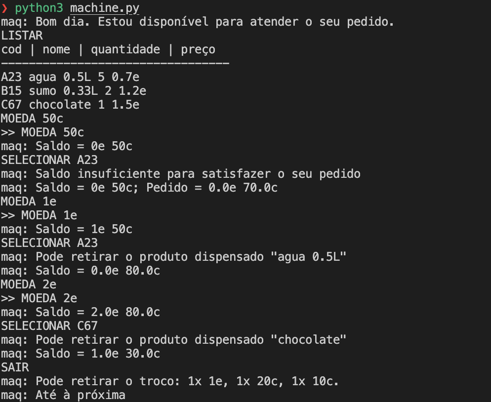

# TPC5 - Máquina de Vending

**Data:** 2025-03-13  
**Autor:** Vicente de Carvalho Castro  
**Número:** A91677  

---

## Resumo
Este programa simula o funcionamento de uma máquina de vending, onde o utilizador pode consultar o stock de produtos, adicionar moedas ao saldo e realizar compras. O sistema gere o inventário, processa as seleções feitas pelos utilizadores e calcula o troco a ser devolvido, oferecendo uma experiência de interação simples e prática. Foi usada a biblioteca `ply.lex`, para processar comandos e interagir com o stock de produtos.

# Estrutura:
- Leitura do Stock
O stock é carregado a partir de um ficheiro JSON (stock.json), onde cada produto possui um código, nome, quantidade e preço.

- Comandos do Utilizador
    1. `LISTAR`: Exibe os produtos disponíveis no stock, com informações como código, nome, quantidade e preço.
    2. `MOEDA`: O utilizador pode inserir moedas (1e, 50c, etc.) e o saldo é atualizado.
    3. `SELECIONAR <CODIGO>`: Permite que o utilizador escolha um produto para comprar, verificando sempre o saldo é suficiente e se há stock disponível.
    4. `SAIR`: Finaliza a interação e, caso o utilizador tenha colocado moedas a mais, calcula o troco.

- Tokens
O lexer é responsável por identificar os comandos e tokens relacionados a produtos e moedas. 
A cada comando, o lexer processa a entrada e executa a ação correspondente (adicionar moedas ao saldo, listar produtos, etc.).

- Saldo e Troco
O saldo é acumulado a partir do comando "MOEDA" e atualizado sempre que moedas válidas são inseridas. 
Quando o comando "SAIR" é invocado, o sistema calcula o troco a ser devolvido ao utilizador, utilizando as moedas disponíveis

- Funções Auxiliares
A função `processar_selecao` lida com a lógica de compra, verificando se o produto existe, se há stock suficiente e se o saldo é suficiente para a compra.
A função `calcular_troco` determina como devolver o troco utilizando as moedas disponíveis.

- Dificuldades
Em algumas funcionalidades, nomeadamente "MOEDA" e "SELECIONAR", os comandos necessitavam "argumentos" necessários para o programa realizar a ação correspondente.
1. Para o comando "MOEDA", o argumento é extraído diretamente da linha do input após o comando "MOEDA" e é processado dividindo a string para obter as moedas individuais. 
2. Para o comando "SELECIONAR", o código do produto é capturado como o próximo token após o comando "SELECIONAR". Esse código é então utilizado para localizar o produto no stock e verificar se o saldo é suficiente para completar a compra.

## Resultados

Os seguintes ficheiros foram gerados durante a realização deste TPC:  
- [`machine.py`](machine.py) - Código desenvolvido  
- [`stock.json`](stock.json) - Ficheiro com o stock guardado
- ['resultado.png'](resultado.png) - Print com o resultado do funcionamento do programa