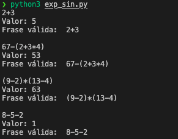
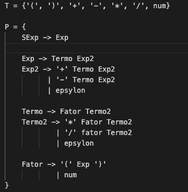

# TPC6 - Parser Recursivo Descendente

**Data:** 2025-03-27  
**Autor:** Vicente de Carvalho Castro  
**Número:** A91677  

---

## Resumo
Para este trabalho foi criado um parser LL(1) recursivo descendente que reconhece expressões aritméticas e calcule o respetivo valor.

# Estrutura:
## Analisador Léxico
O analisador léxico é responsável por converter a sequência de caracteres da entrada em tokens, que serão processados pelo analisador sintático.
Estes estão divididos entre `literals = ['(', ')', '*', '+', '-', '/']`, que aparecem diretamente na entrada, não precisam de regras específicas para reconhecê-los.
E os `tokens = ['num']`, que precisam de regras especiais para serem reconhecidos visto que podem ser compostos por mais que um caracter. Neste caso são os números inseridos pelo utilizador, que são definidos como sequência de dígitos.

O analisador léxico vai reconhecer os tokens através da expressão regular `r'\d+`, transformar num inteiro e retornar esse valor através da função `t_num()`. Espaços, tabs e new lines irão ser ignorados.

## Analisador Sintático
O analisador sintático recebe a sequência de tokens produzida pelo analisador léxico e verifica se ela segue as regras da gramática definida e, neste caso, efetuar os cálculos e apresentar o resultado.
Para este processo é necessário ter bem definidas as funções de todas as progressões presentes na gramática. 

De notar que esta estrutura garante a precedência correta das operações:
1. Multiplicação e divisão são resolvidas antes de soma e subtração.
2. Expressões entre parênteses são resolvidas primeiro.

# Dificuldades

1. Para obedecer ao critério de uma gramática LL1 e esta ser determinística e não haver ambiguidade, criaram-se as "Expressões2" para resolver este problema.
Antes tinhamos a progressão `Exp` definida da seguinte maneira, o parser ao encontrar '+' ou '-', o analisador teria ambiguidade, não sabe se deve continuar a expandir "Exp" ou parar.

> Exp → Termo | Exp '+' Termo | Exp '-' Termo

Agora, com a progressão definida desta maneira o parser reconhece "Termo" e decide se deve continuar com "Exp2" ou parar

>Exp  → Termo Exp2  
>Exp2 → '+' Termo Exp2  
>    | '-' Termo Exp2  
>    | ε  

O mesmo foi feito para a progressão `Termo` originando `Termo2`

2. Outro pormenor que levou algum estudo e compreensão foi o facto de as subtrações nao estavam a ser efetuadas pela ordem correta.
Exmeplo:
> 8 - 5 - 2 = 5

Este era o resultado que o parser obtia, efetuava a subtração da direita para a esquerda, as operações eram adiadas da. Isto devido à maneira como a progressão estava definida:
> Exp2 -> '-' Exp

Desta forma empilhava chamadas recursivas de "Exp" antes de calcular a subtração, acabando por adiar as operações.

Alterou-se então a progressão para:
> Exp2 → '-' Termo Exp2 

Assim, a subtração acontece imediatamente porque "Exp2" recebe um "Termo" inteiro antes de continuar a chamar "Exp2" novamente.
Esta alteração foi feita para todos os casos.

## Resultados

## Gramática

Os seguintes ficheiros foram gerados durante a realização deste TPC:  
- [`exp_lex.py`](exp_lex.py) - Código do Analisador Léxico
- [`exp_sin.py`](exp_sin.py) - Código do Analisador Sintático
- ['resultado_TPC6.png'](resultado.png) - Print com o resultado do funcionamento do programa
- ['gramatica.txt'](gramatica.txt) - Gramática desenvolvida por escrito
